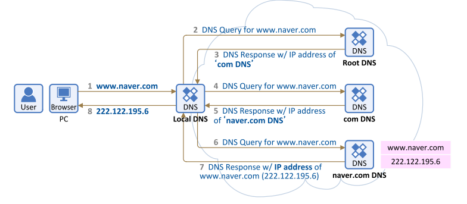
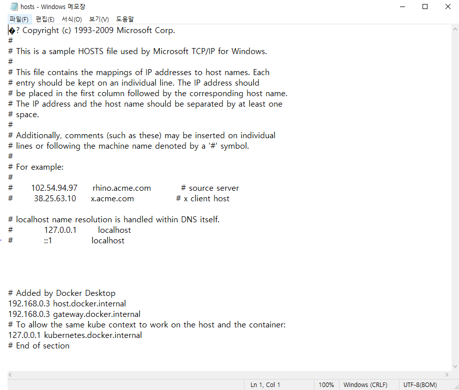

# Browser란?

> 인터넷 웹 서버의 모든 정보를 볼 수 있도록 하고, 문서 검색을 도와주는 응용 프로그램이다.

우리가 일상적으로 인터넷을 통해 검색을 할 때 사용하는 네이버나 구글 같은 사이트에 접속하기 위한 도구를 **브라우저**라고 한다.

한 마디로 브라우저는 제어판과 같이 컴퓨터에 설치되어 있는 하나의 프로그램으로, 이 프로그램을 다운받고 실행하게 되면 주소창을 입력할 수 있는 도구가 나타나게 되는 것입니다. 예시를 하나 보겠습니다.  

## chrome  
  
구글에서 자사의 검색엔진을 지원하는 가장 기본이 되는 프로그램으로 JavaScript를 활용하기 가장 좋은 프로그램입니다. 현재 작성자의 가장 기본이 되는 언어이며 웹 프로그래밍에 있어서 모든 테스트 환경은 chrome을 기반으로 실행하게 됩니다. 장점으로는 빠른 속도와 확장 프록그램 기능, 자유로운 제작과 고급기능 및 개발자 도구 등의 강력한 기능들을 제공하고 있습니다.  

# DNS란?  
Browser에서 무언가 검색을 하기 위해서 사이트에 접속할 것입니다. 그때 사용자는 주로 **Domain Name**이라는 주소를 통해 접속할 수 있습니다. 별것 아니라고 생각할 수 있겠지만 이것 역시 잘 짜여진 구성으로 프로그램 개발자로써 알아둘 필요가 있습니다.  

### 만약 DNS가 없었다면?  
인터넷을 연결하는 각 장치에는 다른 기계가 장치를 찾는 데 사용하는 고유한 IP 주소가 있습니다. 만약 DNS가 없다고 가정하면 우리는 사이트를 검색하기 위해 매번 **192.168.1.1(IPv4)** 이나 **2400:cb00:2048:1::c629:d7a2(IPv6)** 와 같은 IP 주소를 일일이 적을 필요가 있습니다. 이는 매우 불편하고 어려운 일입니다. 이를 위해 DNS가 개발되었습니다.  

### DNS의 작동원리?  
DNS는 번역기라고 생각하면 편리합니다. **호스트 이름(ex. google.com)** 을 컴퓨터 친화적인 **IP주소(ex. 173.194.126.140)** 로 번역해주는 역할을 실행하게 됩니다. DNS가 작동하는 원리 중 주요한 4가지를 한번 보겠습니다.  
- **DNS recursor** - recursor는 도서관 어딘가에서 특정 책을 찾으러 가라는 요청을 받는 사서로 생각할 수 있습니다. DNS 재귀는 웹 브라우저와 같은 응용 프로그램을 통해 클라이언트 시스템에서 쿼리를 수신하도록 설계된 서버입니다. 일반적으로 재귀는 클라이언트의 DNS 쿼리를 충족하기 위해 추가 요청을 수행합니다.  
- **루트 이름 서버** - 루트 서버 는 사람이 읽을 수 있는 호스트 이름을 IP 주소로 변환(해석)하는 첫 번째 단계입니다. 다른 책꽂이를 가리키는 도서관의 색인처럼 생각할 수 있습니다. 일반적으로 다른 특정 위치에 대한 참조 역할을 합니다.  
- **TLD 네임서버** - 최상위 도메인 서버( TLD )는 도서관에 있는 특정 책 랙으로 생각할 수 있습니다. 이 네임서버는 특정 IP 주소 검색의 다음 단계이며 호스트 이름의 마지막 부분을 호스팅합니다(example.com에서 TLD 서버는 "com").  
- **권위 있는 네임서버** - 이 최종 네임서버는 책꽂이에 있는 사전으로 생각할 수 있으며, 여기서 특정 이름은 정의로 번역될 수 있습니다. 권한 있는 이름 서버는 이름 서버 쿼리의 마지막 중지입니다. 권한 있는 이름 서버가 요청된 레코드에 액세스할 수 있는 경우 요청된 호스트 이름의 IP 주소를 초기 요청을 한 DNS Recursor(사서)에게 다시 반환합니다.  

위 내용들이 어렵다고 생각한다면 정상입니다. 어디까지나 정의적인 문제이니 이런게 있구나 하며 여러번 읽어서 외우고 이해는 뒤에 넘어가서 다시 돌아본다면 그렇구나 이해할 수 있다는 점 미리 알려드리겠습니다.  

아래 이미지를 통해 간략히 보여드리겠습니다.  
  
많이 생략된 부분이 있지만 가장 간단한 예시 이미지를 들고왔습니다. 여러분들이 평소에 쓰는 서버라는 개념 중간에 한가지 기능이 더 있다고 생각하면 편합니다. 물론 좀더 세부적으로 분석했을 때는 더욱 어렵습니다.  
  
각 단계를 설명하자면 
1. 사용자가 웹 브라우저에 'naver.com'을 입력하면 쿼리가 인터넷으로 이동하고 DNS 재귀 해석기에 의해 수신됩니다.  
2. 그런 다음 확인자는 DNS 루트 이름 서버(.)를 쿼리합니다.  
3. 그런 다음 루트 서버는 해당 도메인에 대한 정보를 저장하는 최상위 도메인(TLD) DNS 서버(예: .com 또는 .net)의 주소로 확인자에 응답합니다. naver.com을 검색할 때 요청은 .com TLD를 가리킵니다.  
4. 그런 다음 확인자는 .com TLD에 요청합니다.  
5. 그러면 TLD 서버는 도메인 이름 서버의 IP 주소인 naver.com으로 응답합니다.  
6. 마지막으로 재귀 해석기는 도메인의 이름 서버에 쿼리를 보냅니다.  
7. 그러면 naver.com의 IP 주소가 네임서버에서 해석기로 반환됩니다.  
8. 그런 다음 DNS 확인자는 처음에 요청한 도메인의 IP 주소로 웹 브라우저에 응답합니다.  
DNS 조회의 8단계가 naver.com에 대한 IP 주소를 반환하면 브라우저는 웹 페이지를 요청할 수 있습니다.  
9. 브라우저는 IP 주소에 HTTP 요청을 합니다.   
10. 해당 IP의 서버는 브라우저에서 렌더링할 웹페이지를 반환합니다(10단계).  

### DNS의 단점?  
클라이언트가 서버에 접근하기 전 다른 서버로 접근해 도메인 주소를 가져오는 과정은 사용자 입장에서는 매우 좋지만 **시스템 설계적으로 봤을때는 매우 안좋습니다**  
중간에 어딘가를 거쳤다가 방문한다는 개념이 속도에 지연을 의미하기 때문에 해결책이 필요했습니다. 그래서 제안된 개념이 **DNS 캐시** 입니다.

### DNS 캐시  
캐시는 사용자 플레시 메모리 입니다. 한번이라도 DNS 서버를 통해 IP주소를 끌어오게 되면 사용자는 해당 IP 주소를 캐시 메모리에 저장을 합니다. 이 데이터는 사용자가 따로 정리를 하지 않는 이상은 계속 캐시 메모리에 저장된다는 사실을 알 수 있습니다. 하지만 이 역시 문제점이 없지는 않습니다. 사용자가 캐시를 삭제한다면 해당 사이트에 이동할 때 다시 DNS에 접근해야 한다는 점이 있고 악의적인 사용자가 host 파일을 해킹해 사이트 접속을 차단하거나 다른 사이트에 접속하도록 만들 수 있습니다.  
  
구식적인 방법이지만 해당 파일을 해킹해 은행 사이트를 우회시켜 사용자 정보를 캐내는 해킹 방법이 있는만큼 만능이라고 볼 수는 없습니다.  
