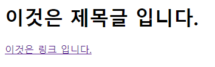
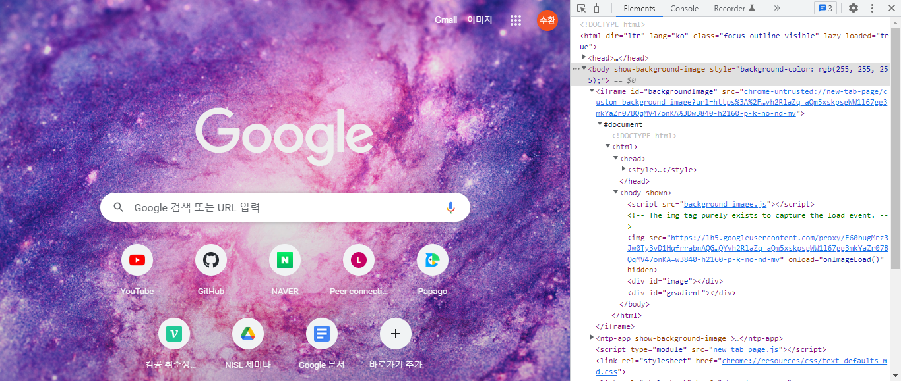

# HTML이란?  
**HT - HyperText, M - Markup, L - Language**  
웹 페이지를 만들기 위한 언어로 웹 브라우저 위에서 동작하는 언어입니다.  

---
## 웹 페이지란?  
**월드 와이드 웹(WWW)** 상에 올라와 있는 문서들을 가르키는 말입니다. .gif, jpg, .Ai, .pdf, .doc, .hwp와 같은 확장자가 있듯이 **html은 `.html`이라는 확장자** 를 가진다는 특징이 있습니다.  

여러분들이 보고 있는 사이트들은 태초에 문서 정리를 위해 만들어진 것이며 이 문서들을 인터넷을 통해 공유하고 있는 형태가 현재의 네트워크 망입니다.  

앞으로 **HTML 작성을 문서 작성** 이라고 생각하면 편리하겠습니다. 한글과 엑셀이 각각 글을 작성하는 방법이나 사용방법이 다른것 처럼 HTML역시 고유의 방식이 있고 자연스럽게 사용하기 위해서는 공부할 필요가 있습니다.  

---
## 태그?  
태그는 앞서 말한 HTML의 글을 쓰는 방법입니다.  
```html
<태그명 속성명 = "속성값"> 컨텐츠 </태그명>
```  
여기서 **태그는 `컨텐츠` 부분이 어떠한 성격을 가지는 지 의미하고 속성명은 구체적인 역할을 지시해준다** 생각하시면 됩니다.  
예를 들어 링크가 있는 글을 작성해 보겠습니다.  
```html
<h1>이것은 제목글 입니다.</h1>
<a href="https://www.naver.com/">이것은 링크 입니다.</a>
```  
실제로 위 코드를 그대로 실행할 경우 아래와 같이 실행이 됩니다.  
  
위 링크는 겉보기만 있는 것이 아닌 실제 클릭해볼 경우 네이버로 정상적으로 접속이 가능하다는 것을 알 수 있습니다. 그렇다면 태그 없이 글을 작성하게 되면 어떻게 될까요?  
```html
글을 그냥 작성해보겠습니다.
```  
  
아무것도 없습니다. **양식을 지키지 않은 방식은 브라우저 환경에서 실행이 안된다** 는 모습을 알 수 있습니다.  

우리가 평상시 사용하던 **네이버 구글 등등 모든 페이지가 기본 html로 만들어졌다는 것** 을 알 수 있습니다. 그 예시로 구글에 접속해 F12번을 통해 개발자 도구로 들어가보겠습니다.  
  
형태가 다양하지만 기본 ```<태그명 속성명 = "속성값"> 컨텐츠 </태그명>```을 지키고 있다는 것을 알 수 있습니다.  

---
## 기본이 되는 HTML 형식  
tag는 기본 규칙이 있습니다.  
```html
<html>
    <head></head>
    <body></body>
</html>
```  
모든 html 문서는 `<html>`태그로 시작하고 `</html>`태그로 닫습니다. 이 사이에 영역을 나눠서 문서를 작성하게 되고 기본은 `<head>`와 `<body>`가 되겠습니다. 특별한 경우를 제외하고는 모든 html 파일은 위 규칙을 기본으로 하고 있습니다.  

만약 html을 작성하기 위해 글을 작성한다고 한다면 기본 `<body>`태그 안에 무언가를 적을 것입니다.  
```html
<html>
    <head></head>
    <body>
        <h1>이것은 제목글 입니다.</h1>
        <a href="https://www.naver.com/">이것은 링크 입니다.</a>
    </body>
</html>
```  
여기까지 온다면 거의 다 했습니다. 마지막으로 DTD에 대한 설명을 하겠습니다.  

---
## HTML 문서 작성 전 DTD  
HTML을 작성하려면 **문서타입** 이라는 것을 반드시 적어주어야 합니다.  

문서 타입을 **DTD(DOCTYPE or Document type Definition)** 라고 하며 **반드시 HTML문서의 최상위에 위치** 해야 합니다.