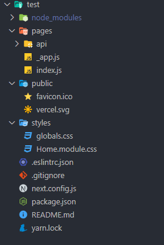
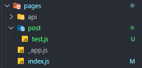
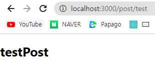

# Next JS시작 전  

**Next JS**는 React로 만드는 **서버사이드 렌더링** 프레임 워크입니다. 본격적으로 시작하기 앞서 서버사이드 렌더링이란 무엇인지에 대해 먼저 시작하겠습니다.  

---
## 서버사이드 렌더링이란?  
서버 사이드 렌더링이란 서버에서 페이지를 그려 클라이언트로 보낸 후 화면에 표기하는 기법을 의미합니다. **뷰 싱글 페이지 애플리케이션(HTML)** 을 서버 사이드 렌더링의 반대인 **클라이언트 사이드 렌더링** 방식입니다.  

### 클라이언트 사이드 렌더링  
클라이언트 사이드 렌더링을 이해하기 위해 뷰 CLI로 생성된 프로젝트의 결과를 살펴보겠습니다. 아래는 react rfc로 생성된 프로젝트의 기본 코드입니다.  
```js
import logo from './logo.svg';
import './App.css';

function App() {
  return (
    <div className="App">
      <header className="App-header">
        
        <p>
          Edit <code>src/App.js</code> and save to reload.
        </p>
        <a
          className="App-link"
          href="https://reactjs.org"
          target="_blank"
          rel="noopener noreferrer"
        >
          Learn React
        </a>
      </header>
    </div>
  );
}

export default App;
```  
아래는 Root에 생성되는 기본 Html 형식입니다.
```js
<!DOCTYPE html>
<html lang="en">
  <head>
    <meta charset="utf-8" />
    <link rel="icon" href="%PUBLIC_URL%/favicon.ico" />
    <meta name="viewport" content="width=device-width, initial-scale=1" />
    <meta name="theme-color" content="#000000" />
    <meta
      name="description"
      content="Web site created using create-react-app"
    />
    <link rel="apple-touch-icon" href="%PUBLIC_URL%/logo192.png" />
    <!--
      manifest.json provides metadata used when your web app is installed on a
      user's mobile device or desktop. See https://developers.google.com/web/fundamentals/web-app-manifest/
    -->
    <link rel="manifest" href="%PUBLIC_URL%/manifest.json" />
    <!--
      Notice the use of %PUBLIC_URL% in the tags above.
      It will be replaced with the URL of the `public` folder during the build.
      Only files inside the `public` folder can be referenced from the HTML.

      Unlike "/favicon.ico" or "favicon.ico", "%PUBLIC_URL%/favicon.ico" will
      work correctly both with client-side routing and a non-root public URL.
      Learn how to configure a non-root public URL by running `npm run build`.
    -->
    <title>React App</title>
  </head>
  <body>
    <noscript>You need to enable JavaScript to run this app.</noscript>
    <div id="root"></div>
    <!--
      This HTML file is a template.
      If you open it directly in the browser, you will see an empty page.

      You can add webfonts, meta tags, or analytics to this file.
      The build step will place the bundled scripts into the <body> tag.

      To begin the development, run `npm start` or `yarn start`.
      To create a production bundle, use `npm run build` or `yarn build`.
    -->
  </body>
</html>
```
프로젝트를 기본으로 생성한 후 yarn start(npm의 경우 npm start)를 할 경우 아래와 같이 아무것도 안적은 상태에서 기본 페이지가 나온다는 것을 알 수 있습니다. 이 때 개발자 패널의 `Network` 탭에서 `Doc`으로 필터링 한 결과는 아래와 같습니다.  


서버에서 넘겨받은 HTML 코드에는 `body` 태그 본문에 `<div>` 밖에 없지만 실제 개발자 도구에서는 더 많은 것들이 구현되있다는 모습을 알 수 있습니다. 이 텍스트와 이미지는 모두 클라이언트(브라우저)에 동작한 `App.js` 라이브러리가 그려준 것 입니다. 즉 브라우저에서 화면의 결과를 그려낸 것입니다.  

## 서버 사이드 렌더링과 클라이언트 사이드 렌더링 차이점  
그럼 서버 사이드 렌더링은 앞에서 살펴본 클라이언트 사이드 렌더링과 무슨 차이점이 있을까? 생각할 수 있습니다. 바로 어디서 페이지의 내용을 그리냐의 차이입니다. 클라리언트 사이드 렌더링은 페이지의 내용을 브라우저에 그리고 서버 사이드 렌더링은 서버에서 페이지의 내용을 다 그려서 브라우저로 던저줍니다. 아래와 같이 말이죠.  

  

## 그래서 서버 사이드 렌더링을 왜 쓸까?  
서버 사이드 렌더링을 쓰는 목적은 크게 **"검색 엔진 최적화"** 와 **"빠른 페이지 렌더링"** 입니다. 검색 엔진 최적화란 구글, 네이버와 같은 검색 사이트에서 검색했을 때 결과가 사용자에게 많이 노출될 수 있도록 최적화 하는 기법입니다. 특히 SNS에서 링크를 공유했을 때 해당 웹 사이트의 정보를 이미지와 설명으로 표시해주는 **OG(Open Graph) Tag** 를 페이지 별로 적용하기 위해서는 서버 사이드 렌더링이 효율적입니다.  

  

또한, 서버 사이드 렌더링은 빈 HTML 페이지를 받아 브라우저에서 그리는 클라이언트 사이드 렌더링과 다르게 서버에서 미리 그려서 브라우저로 보내주기 때문에 페이지를 그리는 시간을 단축할 수 있습니다. 사용자 입장에서는 **화면에 유의미한 정보가 표시되는 시간이 빨리진다는 의미** 입니다.  

## 서버 사이드 렌더링의 단점?  
이렇게 보면 서버 사이드 렌더링을 하는게 좋다라고 생각할 수 있습니다. 하지만 이 방식도 장점만 있는것은 아닙니다. 서버 사이드 렌더링은 **Node.js 웹 애플리케이션 실행 방법** 을 알아야하고 **서버 쪽 환경 구성과 함께 클라이언트, 서버 빌드에 대한 이해** 가 필요합니다. 따라서, 프론트엔드 개발 입문자 입장에서는 쉽지 않은 진입 장벽이 존재합니다.  

또한 Node.js 환경에서 실행되기 때문에 브라우저 관련 API를 다룰 때 주의해야 합니다. 리액트 싱글 페이지 애플리케이션의 라이프 사이클 훅과는 다른 환경(브라우저가 아닌 Node.js)에서 동작하기 때문에 `beforeCreate`와 `created`에서 `window`나 `document`와 같은 **브라우저 객체에 접근할 수 없습니다.** 

# Next.js가 제공하는 주요 기능  
### hot reloading  
개발 중 저장되는 코드는 자동으로 새로고침됩니다.  

### automatic routing  
pages 폴더에 있는 파일은 해당 파일 이름으로 라우팅됩니다. (ex. src/page1.tsx -> localhost:3000/page1)  
public 폴더도 pages의 폴더와 동일하게 라이팅 할수있습니다. 그러나 모든 사람이 페이지에 접근할 수 있으므로 지양하도록합니다.  

### single file components  
`style jsx`를 사용함으로 컴포넌트 내부에 컴포넌트만 스코프를 가지는 css를 만들수 있습니다.  
- `<style jsx global>`를 사용하면 글로벌로 스타일 정의가 가능합니다.  

```js
// styled-jsx

function Heading(props) {
  const variable = "red";
  return (
    <div className="title">
      <h1>{props.heading}</h1>
      <style jsx>
        {`
          h1 {
            color: ${variable};
          }
        `}
      </style>
    </div>
  );
}

export default function Home() {
  return (
    <div>
      // red
      <Heading heading="heading" />
      // block
      <h1>ttt</h1>
    </div>
  );
}
```  
### 글로벌 스타일 정의 가능합니다.  
`_app.tsx`에만 정의 가능합니다. 다른 컴포넌트에 정의한 경우 다른 클래스와 겹쳐 오류를 발생할 수 있음으로 `_app`에서만 허용합니다. 다른 컴포넌트에 정의시 아래와 같은 오류를 냅니다  

```bash
Global CSS cannot be imported from files other than your Custom <App>. Please move all global CSS imports to pages/_app.tsx. Or convert the import to Component-Level CSS (CSS Modules).
```  
```ts
// _app.tsx
import "./globals.css";

function MyApp({ Component, pageProps }) {
  return <Component ponent {...pageProps} />;
}

export default MyApp;
```

### server landing  
서버 렌더링을 합니다. 클라이언트 렌더링과 다르게 서버렌더링을 한 페이지의 페이지 소스보기를 클릭하면 내부에 소스가 있습니다.  

### code splitting  
dynamic import를 이용하면 손쉽게 코드 스플리팅이 가능합니다.  

코드 스플리팅은 내가 원하는 페이지에서 원하는 자바스크립트와 라이브러리를 렌더링 하는 것입니다. 모든 번들이 하나로 묶이지 않고, 각각 나뉘어 좀 더 효율적으로 자바스크립트 로딩 시간을 개선할 수 있습니다.  

### typescript  
타입스크립트 활용을 위해 웹팩을 만지거나 바벨을 만질 필요가 없습니다. 타입스크립트를 설치하고 (ex. yarn add typescript) 후 바로 실행하면 됩니다. (ex. yarn run dev) 그러면 typescript 설정인 `tsconfig, next-end.d.ts`가 생성되어 타입스크립트가 코딩이 가능해집니다.

### _document.tsx  
meta 태그를 정의하거나, 전체 페이지에 관여하는 컴포넌트입니다.  
```ts
// pages/_document.tsx
import Document, { Html, Head, Main, NextScript } from "next/document";
export default class CustomDocument extends Document {
  render() {
    return (
      <Html>
        <Head>
          // 모든페이지에 아래 메타테크가 head에 들어감 // 루트파일이기에 가능한
          적은 코드만 넣어야함 전역 파일을 엉망으로 만들면 안된다 // 웹 타이틀,
          ga 같은것 넣음
          <meta property="custom" content="123123" />
        </Head>
        <body>
          <Main />
        </body>
        <NextScript />
      </Html>
    );
  }
}
```
- 이곳에서 console은 서버에서만 보이고 클라이언트에서는 안보입니다.  
- render 요소는 반영하지만 페이지 구성 요소만 반영되고 js는 반영 하지 않기 때문에 console은 보이지 않습니다. componentDidMount 같은 훅도 실행 되지 않습니다. 정말 static한 상황만 사용합니다.  

_App.tsx  
```ts
function MyApp({Component, pageProps}) {
  return <Component {...pageProps} />;
}

export default MyApp;
```
- 이곳에서 렌더링 하는 값은 모든 페이지에 영향을 줍니다.
- 최초로 실행되는 것은 `_app.tsx`
- `_app.tsx`은 클라이언트에서 띄우길 바라는 전체 컴포넌트 → 공통 레이아웃임으로 최초 실행되며 내부에 컴포넌트들을 실행함
- 내부에 컴포넌트가 있다면 전부 실행하고 html의 body로 구성
- Component, pageProps를 받습니다.
  - 여기서 props로 받은 Component는 요청한 페이지입니다. GET `/` 요청을 보냈다면, Component 에는 `/pages/index.js` 파일이 props로 내려오게 됩니다.
  - pageProps는 페이지 getInitialProps를 통해 내려 받은 props들을 말합니다.
- 그 다음 `_document.tsx`가 실행됨
- 페이지를 업데이트 하기 전에 원하는 방식으로 페이지를 업데이트 하는 통로
- `_app.tsx`에서 console.log 실행시 client, server 둘다 콘솔 찍힙니다. (localhost:3000 웹과 터미널에서 둘다 콘솔 보임)  

### import style component  
```ts
import styles from "./test.module.css";

function Heading(props) {
  // const variable = "red";
  return (
    <div className="title">
      <h1 className={styles.red}>{props.heading}</h1>
    </div>
  );
}

export default function Home() {
  return (
    <div>
      <Heading heading="heading" />
      <h1>스타일</h1>
    </div>
  );
}
```
```ts
// test.module.css

h1.red {
  color: blue;
}
```  

# NextJS 프로그래밍  
기존 react를 생성하기 위해 사용했던 방식을 비슷하게 사용하겠습니다.   
```yarn create next-app 프로젝트명```  
프로젝트 생성 방법이 `react`에서 `next`로 바뀌었단 것을 제외하면 다를것이 없습니다. 페이지 구성을 보겠습니다.  
  
기존 `react`에서는 `src`에 들어있던 `app.js`가 `pages`폴더로 들어갔다는 사실을 알 수 있습니다. 그리고 뼈대가 되는 root.html이 없다는 사실을 알 수 있습니다. 이게 가장 큰 차이점이라 봅니다.  

> 클라이언트 사이드 렌더링은 클라이언트에서 완성해야하기 때문에 root를 이용해 완성을 했지만 서버 사이드 렌더링은 index.js만 있어도 서버단에서 완성해 보내 root가 필요가 없다. **(자료 검증 필요)**  

그 결과 index.js의 내부 구성을 보겠습니다
```js
//index.js
import Head from 'next/head'
import Image from 'next/image'
import styles from '../styles/Home.module.css'

export default function Home() {
  return (
    <div className={styles.container}>
      <Head>
        <title>Create Next App</title>
        <meta name="description" content="Generated by create next app" />
        <link rel="icon" href="/favicon.ico" />
      </Head>

      <main className={styles.main}>
        <h1 className={styles.title}>
          Welcome to <a href="https://nextjs.org">Next.js!</a>
        </h1>

        <p className={styles.description}>
          Get started by editing{' '}
          <code className={styles.code}>pages/index.js</code>
        </p>

        <div className={styles.grid}>
          <a href="https://nextjs.org/docs" className={styles.card}>
            <h2>Documentation &rarr;</h2>
            <p>Find in-depth information about Next.js features and API.</p>
          </a>

          <a href="https://nextjs.org/learn" className={styles.card}>
            <h2>Learn &rarr;</h2>
            <p>Learn about Next.js in an interactive course with quizzes!</p>
          </a>

          <a
            href="https://github.com/vercel/next.js/tree/canary/examples"
            className={styles.card}
          >
            <h2>Examples &rarr;</h2>
            <p>Discover and deploy boilerplate example Next.js projects.</p>
          </a>

          <a
            href="https://vercel.com/new?utm_source=create-next-app&utm_medium=default-template&utm_campaign=create-next-app"
            className={styles.card}
          >
            <h2>Deploy &rarr;</h2>
            <p>
              Instantly deploy your Next.js site to a public URL with Vercel.
            </p>
          </a>
        </div>
      </main>

      <footer className={styles.footer}>
        <a
          href="https://vercel.com?utm_source=create-next-app&utm_medium=default-template&utm_campaign=create-next-app"
          target="_blank"
          rel="noopener noreferrer"
        >
          Powered by{' '}
          <span className={styles.logo}>
            <Image src="/vercel.svg" alt="Vercel Logo" width={72} height={16} />
          </span>
        </a>
      </footer>
    </div>
  )
}
```  
기존 `react`에서 `root`에 있을법한 파일 구성이 있다는 사실을 알 수 있습니다. 해당 파일을 읽어내 서버단에서 완성한다는 사실을 알 수 있습니다.  

그럼 한번 위에서 언급한 `auto-routing`을 검증해보겠습니다.  
  

`pages`폴더 내부 `post`폴더를 생성하고 `test.js`라는 파일을 생성했습니다.  
```js
//test.js
export default function testPost() {
  return <h1>testPost</h1>;
}
```  
간단한 동작을 보기 위해 머릿말 글을 추가해봤습니다. `yarn run dev`를 통해 `localhost`로 접속할 경우 아래와 같이 링크가 접속이 된다는 것을 알 수 있습니다.  

  
자동으로 폴더 명에 맞게 링크가 수정 되었다는 사실을 알 수 있었습니다. 여기까지 진행을 하셨다면 끝났습니다. 기존 react와 같이 개발을 하면 됩니다.