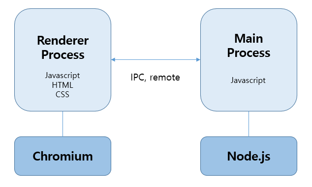

# Electron  

>데스크톱 그래픽 사용자 인터페이스 어플리케이션 개발 프레임 워크  

frontend는 Chromium을 Backend는 Node.js를 하나의 런타임으로 통합하여 구성되었다. Javascript, css, HTML을 이용하여 데스크톱 어플리케이션을 만들수 있다. **크로스플랫폼**을 지원하기 때문에 Window, Mac, Linux 3개의 운영체제와 호환이 가능하다는 장점이 있다  

> ### 크로미움이란?  
> 오픈소스 브라우저 이름이 크로미움이다. 구글이 시작한 오픈 소스 프로젝트로 구글 직원이 아닌 누구라도 브라우저 제작에 참여할 수 있다. 대표적인 예로 **크롬, 엣지, 오페라, 네이버 웨일**등이 있다  

  

## Main process  
Electron에서 package.json의 main 스크립트를 실행하는 프로세스를 메인 프로세스라고 부른다. 메인 프로세스에서 실행되는 스크립트는 웹 페이지들을 GUI 로 표시한다. Electron 앱은 항상 하나의 메인 프로세스를 가지며, 둘 이상이 되는 경우는 없다.  

## Render process  
Electron은 웹페이지를 보여주기 위해 Chromium을 사용하고, 그렇기에 Chromium의 멀티 프로세스 아키텍쳐 또한 사용된다. 각각의 Electron 웹페이지는 자체 프로세스로 동작하고 이것을 the renderer process라고 부른다.  

## Main process와 Renderer process 관계  
- 메인 프로세스는 `BrowserWindow 인스턴스`를 생성하여 웹페이지를 만든다. 각각의 BrowserWindow 인스턴스는 자체 렌더러 프로세스에서 웹 페이지를 실행한다. BrowserWindow 인스턴스가 소멸되면, 해당 렌더러 프로세스도 종료된다.  

- 메인 프로세스는 모든 웹 페이지와 각 페이지들이 소유한 렌더러 프로세스들을 관리한다. 각각의 렌더러 프로세스는 서로 독립적으로 동작하고 그들이 실행된 웹페이지 내에서만 관여를 한다.  

- 웹 페이지에서 네이티브 GUI 관련 API 호출은 허용되지 않는다. 왜냐하면 이것은 매우 위험한 일이고, 리소스 릭을 발생시키기 쉽기 때이다. 웹페이지에서 GUI작업을 수행하려면, 웹 페이지의 렌더러 프로세스가 메인 프로세스에게 이러한 작업을 수행하도록 요청해야 한다.  

## 프로세스간 통신  
메인 프로세스와 렌더러 프로세스의 통신에는 몇 가지 방법이 사용되며, **IPC모듈**과 **remote 모듈**에 의해서 통신이 이루어 진다.  

IPC 모듈은 **ipcMain**과 **ipcRenderer**이 있다  

- ipcMain은 main 프로세스에서 renderer 프로세스들로 비동기적인 통신을 하게 한디.  
- ipcRenderer은 renderer 프로세스에서 main 프로세스로 비동기적인 통신을 한다.  
remote 모듈은 메인 프로세스에서만 사용가능한 api들을 렌더러 프로세스에서 이용할 수 있게 해주는 모듈이다.  

## React와 연결  
두가지 방법이 있다 첫번째는 **react를 먼저 설치**하는 법 두번째는 이미 **electron을 설정해 react를 씌우는 법**이다.  

리액트를 먼저 설치할 경우 
> ```npx create-react-app test``` 프로젝트 명을 test로 설정   

일렉트론을 먼저 설치하는 경우  
> ```npm i -D react react-do react-scripts``` 을 설치  

**Electron 설치**  
> ```yarn add electron electron-builder --dev```  

기타 개발도구 설치(없어도 좋다)  
> ```yarn add electron-is-dev```  
```yarn add concurrently wait-on cross-env --dev```  

- ```electron-is-dev```  
Electron이 개발 환경에서 실행 중인지 확인할 수 있는 패키지

- ```concurrently```  
여러 명령어를 병렬적으로 실행할 수 있게 도와주는 명령어

- ```wait-on```  
특정 포트, 파일, HTTP 자원 등이 활성화될 때까지 기다려주는 크로스 플랫폼 명령어

- ```cross-env```  
프로그램을 CLI 환경에서 실행시킬 때에 Windows, Linux, macOS 등 OS에 관계없이 동일한 문장으로 환경변수를 설정할 수 있게 도와주는 명령어

---
여기서 react는 기본 경로를 잡아두지 않았기 때문에 수정이 필요하다.  
**Electron**을 연결하기 위해서 ```public/electron.js``` 파일과 ```package.json```이 필요하다. **main** 에서 ```electron.js``` 을 **entry file** 로 정의하는 것이 중요하며, react 에서 사용하는 ```pubilc/index.html``` 과 함께 있는 것이 좋다.  

```json
// package.json
{
  ...,
  "description": "YOUR_DESCRIPTION",
  "author": "AUTHOR",
  "main": "public/electron.js", //main 수정
  "homepage": "./", //홈 경로 설정
  "scripts": {
    "react-start": "react-scripts start",
    "react-build": "react-scripts build",
    "react-test": "react-scripts test", 
    "react-eject": "react-scripts eject",
    "start": "concurrently \"cross-env BROWSER=none yarn react-start\" \"wait-on http://localhost:3000 && electron .\"", // 3000 경로로 electron을 실행한다.  
    "build": "yarn react-build && electron-builder", //electron-builder를 추가
    "release": "yarn react-build && electron-builder --publish=always" //electron-builder를 추가  
  },
  ...
}
```  

**electron.js**를 우리가 아직 설정하기 않았기 때문에 아직 실행되지 않는다 react 폴더 public 안에 ```electron.js```를 만들어주자  

```js
const {app, BrowserWindow} = require('electron');
const path = require('path');
const url = require('url');

function createWindow() {
    /*
    * 넓이 1920에 높이 1080의 FHD 풀스크린 앱을 실행시킵니다.
    * */
    const win = new BrowserWindow({
        width:1920,
        height:1080
    });

    /*
    * ELECTRON_START_URL을 직접 제공할경우 해당 URL을 로드합니다.
    * 만일 URL을 따로 지정하지 않을경우 (프로덕션빌드) React 앱이
    * 빌드되는 build 폴더의 index.html 파일을 로드합니다.
    * */
    const startUrl = process.env.ELECTRON_START_URL || url.format({
        pathname: path.join(__dirname, '/../build/index.html'),
        protocol: 'file:',
        slashes: true
    });

    /*
    * startUrl에 배정되는 url을 맨 위에서 생성한 BrowserWindow에서 실행시킵니다.
    * */
    win.loadURL(startUrl);

}

app.on('ready', createWindow);
```
