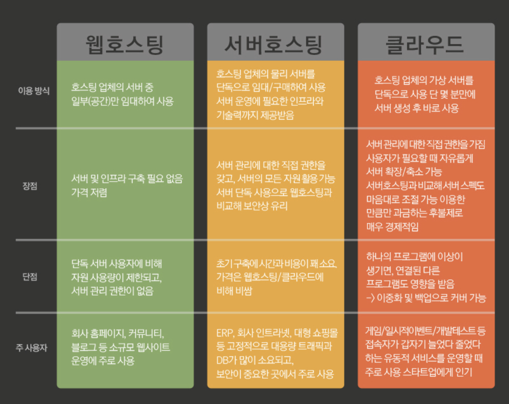
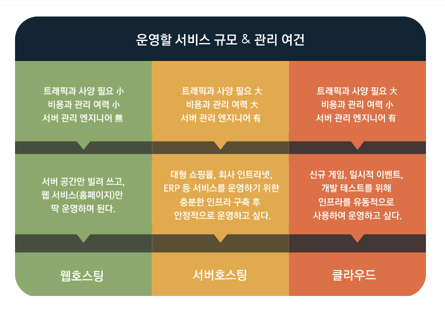

# 웹 호스팅  
프론트엔드 개발자가 HTML과 CSS JS React 등등 개발을 완료해서 실제로 사이트를 등록하려 합니다. 하지만 어떻게 해야할까 하는 문제에 직면하게 됩니다.  
  
DNS 서버는 등록을 해야한다는 점을 알았다면 이제는 **Web Server**가 필요하다는 점을 알 수 있습니다. 다만 서버는 초보 개발자에게 있어 접근성이 매우 떨어집니다. 사람들이 내 컴퓨터에 접속해 html css 파일 등을 받아가야하니 하루종일 켜져 있어야 하는 컴퓨터가 필요하고 이 컴퓨터는 사용자가 몇명이 접속해서 다운받아 가든 버틸 수 있는 제법 괜찮은 성능의 컴퓨터가 필요합니다.  

당장 프론트 개발에 있어서는 내 노트북 혹은 컴퓨터로 개발을 하면 되니 문제가 없었지만 **컴퓨터 하나를 켜둔채로 유지시키는 것은 쉬운 일이 아닙니다.**  

그래서 호스팅이라는 개념을 사용할겁니다.  

---
### 웹 호스팅이란?  
개발자가 홈페이지(웹 사이트)를 올려놓을 **인터넷 상의 공간을 임대해주는 서비스**입니다.  

html css를 통해 간단한 사이트 만들기를 진행하셨다면 알 수 있을겁니다. *해당 홈페이지를 PC에만 저장해두면 인터넷상의 누군가가 검색해서 볼 수 없습니다.*  

*이럴때 필요한 개념이 웹 호스팅입니다.*  
웹 서버를 공유해주는 회사의 일부 공간을 할당받아 그곳에 홈페이지 정보를 올려두면 누구나 인터넷상으로 해당 페이지를 볼 수 있습니다.  
  
어렵게 서버 구축이나 배포 과정을 거칠 필요없이 DNS설정만으로 간단하게 홈페이지를 공개할 수 있으므로 개발자에게 있어서는 큰 장점이라고 보면 됩니다. 물론 이 사이트를 통해 돈을 번다거나 사용자가 너무 몰릴경우 돈을 내야한다는 단점이 있습니다.  

---
### 서버 호스팅이란?  
웹 호스팅이 서버에서 일부만 가져오는 서비스라고 한다면 서버 호스팅은 **컴퓨터 한채를 통채로 빌리는 것**입니다.  

웹 호스팅의 경우 일정 틀이 있어서 그 틀에 맞춰서 DB를 저장하고 서버를 관리하거나 **특정 사이트가 사람이 몰려 서버가 꺼질경우 같은 컴퓨터로 호스팅 되던 다른 사이트도 먹통이 되버리는 단점**이 있습니다.  

이를 해결하기 위해 호스팅 회사의 컴퓨터 한채를 통채로 빌리는 경우가 있습니다. 이는 규모가 큰 사이트가 주로 이용하는 방법으로 DB가 많이 들어오는 사용자가 많은 서비스가 주로 이용하는 방법입니다.

---
### 클라우드 호스팅이란?  
최근 가장 각광받는 방법입니다. 전자의 서버 호스팅이 물리적인 방법으로 서버를 통채로 빌리는 것이라면 클라우드 호스팅은 **가상 서버를 통해 클라우드로 서버**를 받습니다  

이게 무슨 말이냐 바로 흔히들 사용하는 구글 클라우드라고 생각하시면 되겠습니다. 옛날에는 USB를 통해 자료를 옮기고 들고다녀야 했다면 현대는 **구글 클라우드나 카카오톡을 통해 자료를  보관하거나 옮기고 있습니다.** 이 모든 것을 클라우드라고 부르고 있습니다.  

사이트의 소규모 대규모에 상관없이 사용량에 따라 요금을 지불하면 되고 서버 관리 직접 권한을 갖기 때문에 보안적으로 봐도 좋은 선택입니다. 단점으로는 서버 호스팅은 물리적인 서버를 가지기 때문에 접근성 및 권한이 더 많습니다. 이것과 비교해보면 조금은 제한이 있는 것이 클라우드라고 볼 수 있습니다. 다만 이 단점을 커버할 정도로 가성비가 좋은 호스팅 서비스 이기 때문에 **현대에 들은 거의 모든 스타트업이 클라우드 서버를 사용한다고 보시면 되겠습니다.**  

  
  

> 프론트엔드 개발자 역시 궁극적으로는 서버를 구축할 줄 알아야합니다.  

물론 백엔드 개발자와 협업을 통해 따로 관여를 안하는 개발자가 많습니다. 다만 어떤 정보를 서버에 보내고 DB에 저장하고 API를 어떻게 관리하고 등등 **백 엔드 역시 조금은 다룰줄 아는 개발자가 수요가 높다는 점**을 알아야합니다.  

대기업으로 갈 수록 물리적인 회사용 서버를 들고 있다는 점을 생각하면 몸값을 높이기 위해선 서버에 대한 이해도가 필요하다는 점 아셔야합니다.  