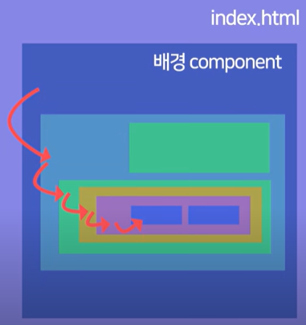
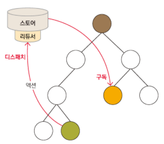

# redux란?  

react에서 프로잭트를 진행하면 props를 계속 불러와야 할 경우가 있다.  

  

위와 같은 경우 **props에서 오류**가 발생할 때 일일이 모든 component를 타고 올라가며 수정을 해야하는 문제가 발생한다.  

리덕스를 이용할 경우 **Store**라는 개체 내부에 상태를 담게 된다. 이 경우 일일이 component가 props를 받아오는 형태가 아닌 **구독과 액션**이라는 실행을 통해 바로 적용이 가능하다.  

  

1. 상태에서 어떤 변화를 일으켜야 할때 액션이라는 것을 스토어에 전달한다. 액션은 객체 형태로 되어있으며, 상태를 변화시킬때 이 객체를 참조하여 변화를 일으킨다. 액션을 전달하는 과정을 **디스패치**라고 한다  

2. 스토어가 액션을 받으면 리듀서가 전달받은 액션을 어떻게 변화해야 할지 정한다. 액션을 처리하면 새 상태를 스토어에 저장한다.  

3. 스토어 안에 있는 상태가 변하면 스토어를 구독하고 있는 컴포넌트에 바로 전달한다. 부모 컴포넌트로 props를 전달하는 작업은 생략하며, 리덕스에 연결하는 함수를 사용하여 컴포넌트를 스토어에 구독시킨다.  

간단한 예시를 하나 제시하겠다.  

```js
//index.js
import react from 'React';

ReactDOM.render(
    <React.StrictMode>
        <App />
    </React.StrictMode>,
    document.getElementById('root')
)
```  
위 index.js는 cra를 할 경우 기본으로 설정된다. 이 파일은 최상위 루트로 모든 컴포넌트를 포함하고 있다.  

여기에 redux를 추가하겠다.
```js
//index.js
import react from 'React';
import { Provider } from 'react-redux';
import { createStore } from 'redux';

const number = 10; //변경하고자 하는 props 값

//reducer 함수 원래는 store.js에 포함시킨다.
function reducer(state = number, action){
    return state
}

let store = createStore(reducer);

ReactDOM.render(
    <React.StrictMode>
        <Provider store={store}>
            <App />
        </Provider>
    </React.StrictMode>,
    document.getElementById('root')
)
```  
위와 같은 코드를 완성할 수 있다. 위와 같은 상황에서 index.js에 포함된 모든 컴포넌트는 따로 props를 처리하지 않아도 number를 들고올 수 있다. 예를 들어 App.js에 불러본다고 가정하자  

```js
//App.js
import react from 'React';
import { useSelector } from 'react-redux';

function App(){
    const storeValue = useSelector( (state) => state );

    return(
        <div classname = "App">
            <p>store의 값은 {storeValue} 입니다</p>
        </div>
    );
}

export default App;
```  
위와 같이 불러 쓸 수 있다. 여기까지 오면 장단점에 대한 얘기가 가능하다  
> ## 장점  
- 상태 관리가 용이하다
    - 기존의 props를 이용해 주고 받는 개념보단 오류 찾기가 쉬워졌다, 즉 상태를 중앙 집권화를 통해 한번에 관리가 가능하다.  

> ## 단점  
- redux의 엄격한 규칙  
    - redux는 매우 엄격한 규칙을 들고 있으며 모든 개발자가 이 규칙에 맞게 행동해야 한다 이 때문에 오히려 코드가 길어 질 수 있다.  
- redux 자체의 어려움  
    - redux에 관해 굉장히 쉽다는 듯이 적어뒀지만 위에서 말한 규칙과 이해 때문에 개발자들이 상당히 시간을 오래 잡아먹는 파트라는 사실을 잊으면 안된다. 어려운 개념으로 넘어갈 경우 끝도없는 심연을 보게된다.  